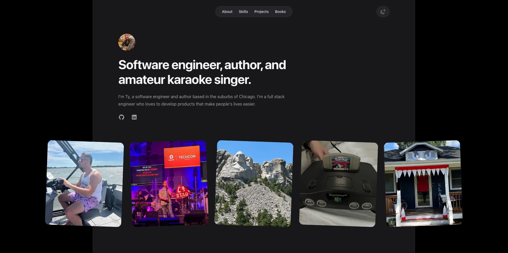

<!-- PROJECT SHIELDS -->

[![Contributors][contributors-shield]][contributors-url]
[![Forks][forks-shield]][forks-url]
[![Stargazers][stars-shield]][stars-url]
[![Issues][issues-shield]][issues-url]
[![MIT License][license-shield]][license-url]
[![LinkedIn][linkedin-shield]][linkedin-url]

<!-- PROJECT LOGO -->
<br />
<p align="center">
  <a href="https://github.com/SciFiTy10/portfolio-2.0">
    
  </a>

  <h3 align="center">My Portfolio</h3>

  <p align="center">
    A website I built to house all my projects and books
    <br />
    <a href="https://github.com/SciFiTy10/portfolio-2.0"><strong>Explore the docs »</strong></a>
    <br />
    <br />
    <a href="https://www.tylerridings.dev">View Demo</a>
    ·
    <a href="https://github.com/SciFiTy10/portfolio-2.0/issues">Report Bug</a>
    ·
    <a href="https://github.com/SciFiTy10/portfolio-2.0/issues">Request Feature</a>
  </p>
</p>

<!-- TABLE OF CONTENTS -->
<details open="open">
  <summary>Table of Contents</summary>
  <ol>
    <li>
      <a href="#about-the-project">About The Project</a>
      <ul>
        <li><a href="#built-with">Built With</a></li>
        <li><a href="#cicd-and-hosting">CI/CD and Hosting</a></li>
        <li><a href="#project-folder-structure">Project Folder Structure</a></li>
      </ul>
    </li>
    <li>
      <a href="#getting-started">Getting Started</a>
      <ul>
        <li><a href="#prerequisites">Prerequisites</a></li>
        <li><a href="#installation">Installation</a></li>
        <li><a href="#running-project">Running Project</a></li>
      </ul>
    </li>
    <li><a href="#usage">Usage</a></li>
    <li><a href="#roadmap">Roadmap</a></li>
    <li><a href="#contributing">Contributing</a></li>
    <li><a href="#license">License</a></li>
    <li><a href="#contact">Contact</a></li>
    <li><a href="#acknowledgements">Acknowledgements</a></li>
  </ol>
</details>

<!-- ABOUT THE PROJECT -->

## About The Project

<!--add link to main page -->


Welcome to my portfolio site!

This is a project I built to showcase my programming projects and the book that I wrote.

---

### Built With

- [React](https://reactjs.org)
- [NextJS](https://nextjs.org)
- [TailwindCSS](https://tailwindcss.com)

---

### CI/CD and Hosting

- [Netlify](https://www.netlify.com) - for builds, deployments, and hosting of the project

---

### Project Folder Structure

This project is organized following the NextJS app router standard.

- Below the app folder, each page of the project is given its own folder and page.tsx file

- Within the same app folder, there are app specific pages like layout.tsx, not-found.tsx, page.tsx (main landing page), and any providers via providers.tsx

- Common components are kept within a components folder

- The images folder holds logos and images used across the application

---

<!-- GETTING STARTED -->

## Getting Started

To get a local copy up and running follow these simple steps.

### Prerequisites

Make sure you have the latest version of npm installed

- npm
  ```sh
  npm install npm@latest -g
  ```

---

### Installation

1. Clone the repo
   ```sh
   git clone https://github.com/SciFiTy10/portfolio-2.0.git
   ```
2. Install NPM packages
   ```sh
   npm install
   ```

---

### Running Project

1. Running the project in development mode

   ```sh
   npm run dev
   ```

   Then open https://localhost:3000 in your browser.

<!-- ROADMAP -->

## Roadmap

See the [open issues](https://github.com/SciFiTy10/portfolio-2.0/issues) for a list of proposed features (and known issues).

<!-- CONTRIBUTING -->

## Contributing

Contributions are what make the open source community such an amazing place to learn, inspire, and create. Any contributions you make are **greatly appreciated**.

1. Fork the Project
2. Create your Feature Branch (`git checkout -b feature/AmazingFeature`)
3. Commit your Changes (`git commit -m 'Add some AmazingFeature'`)
4. Push to the Branch (`git push origin feature/AmazingFeature`)
5. Open a Pull Request

<!-- LICENSE -->

## License

Distributed under the MIT License. See `LICENSE` for more information.

<!-- CONTACT -->

## Contact

Tyler Ridings - [LinkedIn](https://www.linkedin.com/in/tyler-ridings-24804585/)

Personal Portfolio - [https://www.tylerridings.dev](https://www.tylerridings.dev)

Project Link - [https://www.tylerridings.dev](https://www.tylerridings.dev)

<!-- MARKDOWN LINKS & IMAGES -->

[contributors-shield]: https://img.shields.io/github/contributors/SciFiTy10/portfolio-2.0.svg?style=for-the-badge
[contributors-url]: https://github.com/SciFiTy10/portfolio-2.0/graphs/contributors
[forks-shield]: https://img.shields.io/github/forks/SciFiTy10/portfolio-2.0.svg?style=for-the-badge
[forks-url]: https://github.com/SciFiTy10/portfolio-2.0/network/members
[stars-shield]: https://img.shields.io/github/stars/SciFiTy10/portfolio-2.0.svg?style=for-the-badge
[stars-url]: https://github.com/SciFiTy10/portfolio-2.0/stargazers
[issues-shield]: https://img.shields.io/github/issues/SciFiTy10/portfolio-2.0.svg?style=for-the-badge
[issues-url]: https://github.com/SciFiTy10/portfolio-2.0/issues
[license-shield]: https://img.shields.io/github/license/SciFiTy10/portfolio-2.0.svg?style=for-the-badge
[license-url]: https://github.com/SciFiTy10/portfolio-2.0/LICENSE.txt
[linkedin-shield]: https://img.shields.io/badge/-LinkedIn-black.svg?style=for-the-badge&logo=linkedin&colorB=555
[linkedin-url]: https://www.linkedin.com/in/tyler-ridings-24804585/
